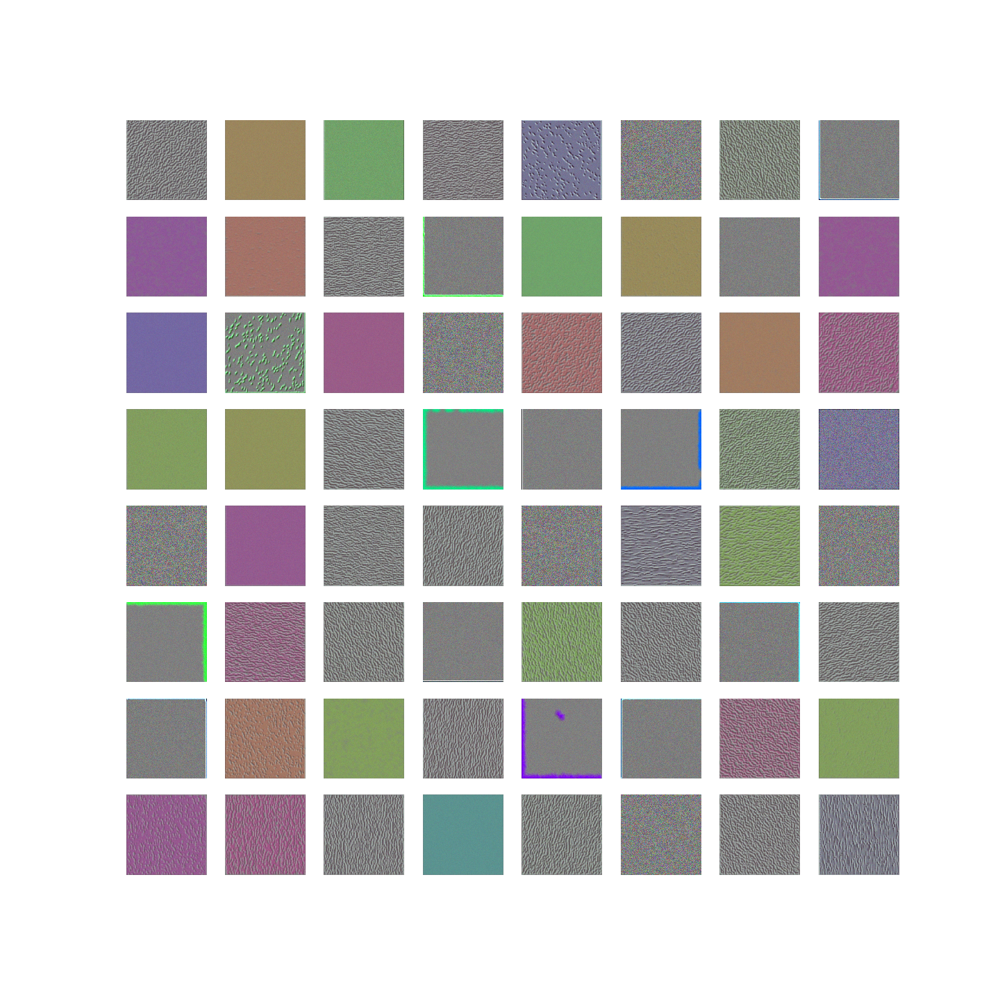
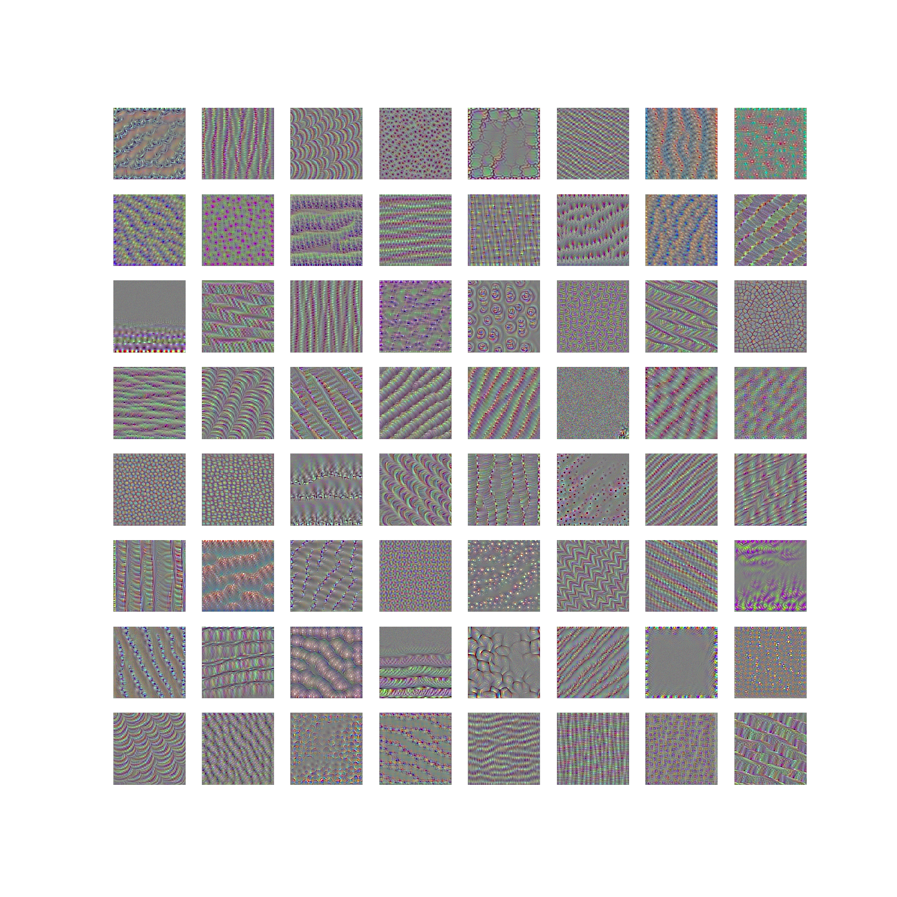
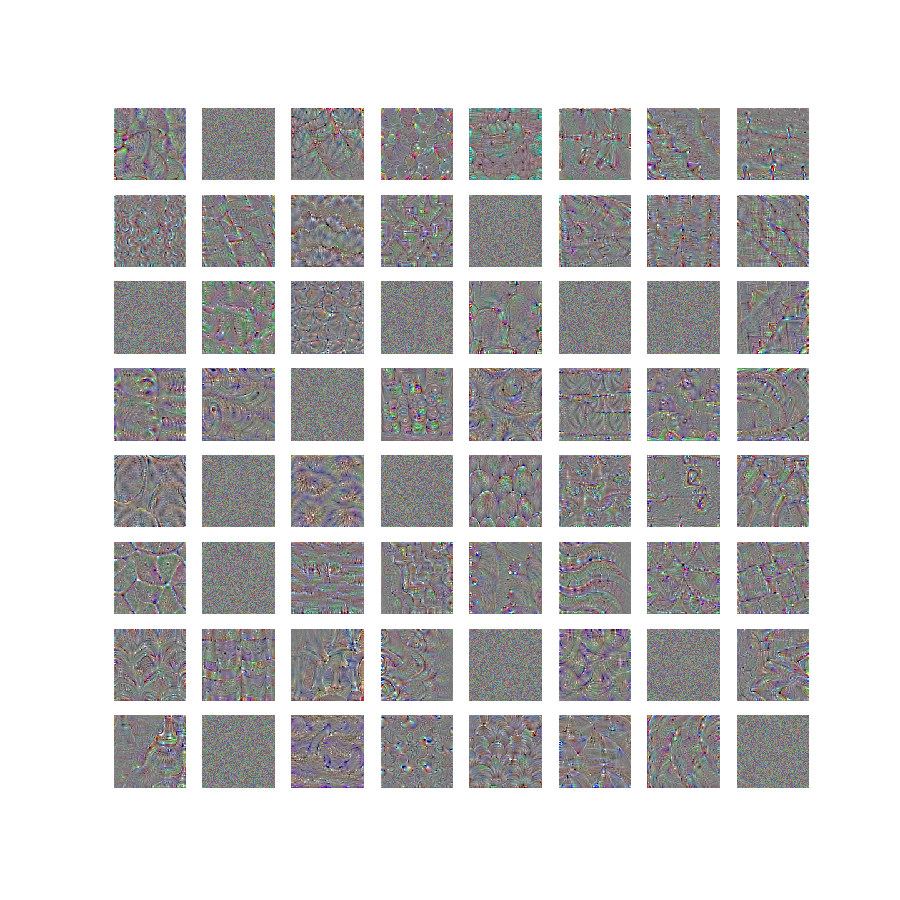

#### Visualizing what convnets learn

It is often said that deep learning models are "black boxes", learning representations that are difficult to extract and present in a human-readable form. While this is partially true for certain types of deep learning models, it is definitely not true for convnets. The representations learned by convnets are highly amenable to visualization, in large part because they are representations of visual concepts.

Visualizing convnets filters is useful to understand precisely what visual pattern or concept each filter in a convnet is receptive to.

We will use the VGG16 model to Visualiz convnets filters.

#### Visualizing convnet filters

Visualizing convnets filters is to display the visual pattern that each filter is meant to respond to. This can be done with gradient ascent in input space: applying gradient descent to the value of the input image of a convnet so as to maximize the response of a specific filter, starting from a blank input image. The resulting input image would be one that the chosen filter is maximally responsive to.

The process is simple: we will build a loss function that maximizes the value of a given filter in a given convolution layer, then we will use stochastic gradient descent to adjust the values of the input image so as to maximize this activation value. For instance, here's a loss for the activation of filter 0 in the layer "block3_conv1" of the VGG16 network, pre-trained on ImageNet:

#### See also

For more information, please refer to:

* [Deep Learning with Python](https://www.manning.com/books/deep-learning-with-python?a_aid=keras&a_bid=76564dff)
* [My Video](https://www.linkedin.com/posts/joseph-huang-793541167_visualizing-what-convnets-learn-2-visualizing-activity-6673809990991654912-R1tr)
